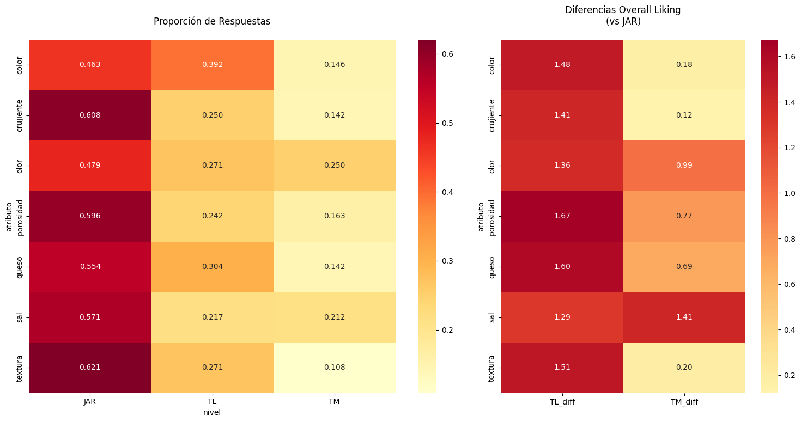
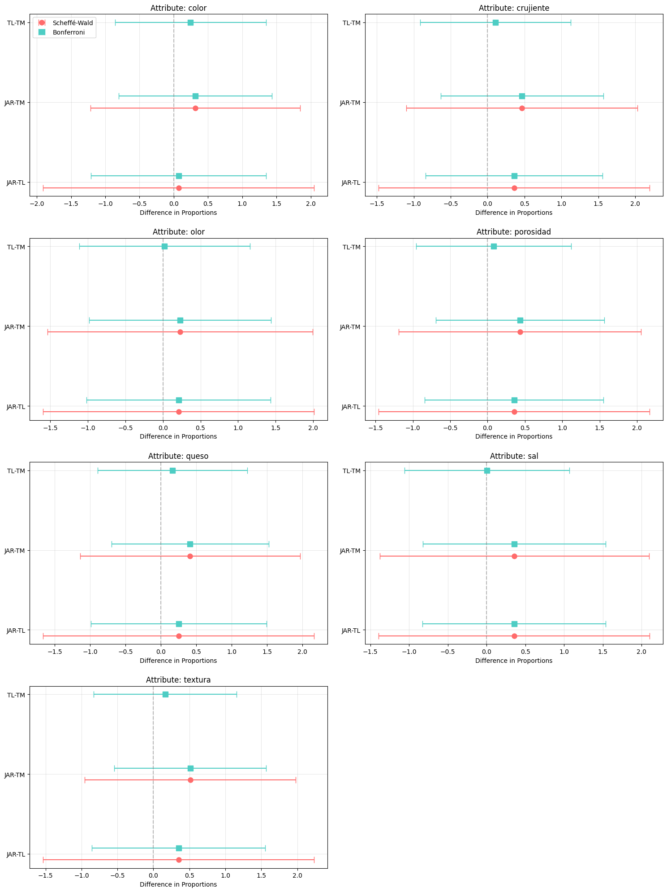

# Implementation of Scheffe-Wald test on a Penalty analysis


```python
import pandas as pd
import numpy as np
import os
import sys
from pathlib import Path

import pandas as pd
import numpy as np
from typing import Dict, List, Tuple
import matplotlib.pyplot as plt
import seaborn as sns
```


```python
CURRENT_PATH = Path.cwd()
MAIN_DIR = os.path.abspath(CURRENT_PATH.parent)
INPUT_DIR = os.path.join(CURRENT_PATH, 'data')
```


```python
print(sys.path)
```

    ['/usr/lib/python312.zip', '/usr/lib/python3.12', '/usr/lib/python3.12/lib-dynload', '', '/home/sharon/.cache/pypoetry/virtualenvs/tesis-XL-UlrQA-py3.12/lib/python3.12/site-packages']


```python
sys.path.append(MAIN_DIR)
sys

from scheffewald.multiple_comparisons import *
from scheffewald.visualization import *
from scheffewald.penalty_visualizations import *
```

# READ DATA


```python
df = pd.read_csv(os.path.join(INPUT_DIR,'dt_compMult_formula_182.csv' ))

CONTEOS = (
    df
    .groupby(['atributo','nivel'])['sbj_num']
    .nunique()
    .reset_index()
)
```


```python
OVERALL_LIKING = pd.read_csv(os.path.join(INPUT_DIR, 'dt_penalty.csv'))
OVERALL_LIKING['atributo'] = OVERALL_LIKING['atributo'].str.lower()
OVERALL_LIKING['nivel'] = OVERALL_LIKING['nivel'].str.upper()

```


```python
def get_counts_for_attribute(df_counts: pd.DataFrame, atributo: str) -> list:
    """
    Extracts counts in order JAR, TL, TM for a given attribute.
    """
    counts = df_counts[df_counts['atributo'] == atributo].sort_values('nivel')
    return [
        counts[counts['nivel'] == 'JAR']['proporcion'].iloc[0],
        counts[counts['nivel'] == 'TL']['proporcion'].iloc[0],
        counts[counts['nivel'] == 'TM']['proporcion'].iloc[0]
    ]
```


```python
def plot_penalty_heatmap(df_ol: pd.DataFrame, df_counts: pd.DataFrame, title: str = "Penalty Analysis Heatmap"):
    """
    Creates a heatmap visualization using DataFrames.
    """
    # Prepare data for proportions
    prop_data = df_counts.pivot_table(
        values='sbj_num', 
        index='atributo', 
        columns='nivel', 
        aggfunc='sum'
    )
    
    # Calculate proportions
    total_responses = prop_data.sum(axis=1)
    prop_data = prop_data.div(total_responses, axis=0)
    
    # Calculate overall liking differences
    ol_data = df_ol.pivot_table(
        values='overall_liking',
        index='atributo',
        columns='nivel'
    )
    
    ol_diffs = pd.DataFrame({
        'TL_diff': ol_data['JAR'] - ol_data['TL'],
        'TM_diff': ol_data['JAR'] - ol_data['TM']
    })
    
    # Create figure with two subplots
    fig, (ax1, ax2) = plt.subplots(1, 2, figsize=(15, 8), gridspec_kw={'width_ratios': [1.5, 1]})
    
    # Plot proportions heatmap
    sns.heatmap(prop_data, 
                annot=True, 
                fmt='.3f',
                cmap='YlOrRd',
                ax=ax1)
    ax1.set_title('Proporción de Respuestas', pad=20)
    
    # Plot overall liking differences heatmap
    sns.heatmap(ol_diffs,
                annot=True,
                fmt='.2f',
                cmap='RdYlBu_r',
                center=0,
                ax=ax2)
    ax2.set_title('Diferencias Overall Liking\n(vs JAR)', pad=20)
    
    plt.suptitle(title, fontsize=14, y=1.05)
    plt.tight_layout()
    return fig, (ax1, ax2)

plot_penalty_heatmap(OVERALL_LIKING, CONTEOS, title="")
```


    (<Figure size 1500x800 with 4 Axes>,
     (<Axes: title={'center': 'Proporción de Respuestas'}, xlabel='nivel', ylabel='atributo'>,
      <Axes: title={'center': 'Diferencias Overall Liking\n(vs JAR)'}, ylabel='atributo'>))


    

    


```python
df_result = pd.DataFrame()
alpha = 0.20

# Matriz de contraste para las comparaciones
A = np.array([
    [1, -1, 0],   # JAR vs TL
    [1, 0, -1],   # JAR vs TM
])

for attribute in OVERALL_LIKING['atributo'].unique():
    counts = get_counts_for_attribute(OVERALL_LIKING, attribute)

    test = StatisticalTest(counts, alpha=alpha)

    bonf_result = test.bonferroni_confidence_intervals()
    #tukey_result = test.tukey_confidence_intervals()
    scheffe_result = test.scheffe_wald_test(A, fisher_correction=False)

    # Print results 
    print(str.upper(attribute),"*" * 70)
    print_test_results([scheffe_result, bonf_result])
    print("=" * 80)

    for method in [scheffe_result, bonf_result]:
        result = pd.DataFrame(format_test_results(method))
        result['attribute'] = attribute
        
        df_result = pd.concat([df_result, result]) 

df_result['p_i-p_j'] = df_result['p_i-p_j'].str.replace('0','JAR').str.replace('1','TL').str.replace('2','TM')

```

    COLOR **********************************************************************
    
    Scheffé-Wald results:
    Overall p-value: 0.8668
    Test statistic: 0.2858
    Degrees of freedom: (df=2)
    
    Pairwise Comparisons:
    Category i	Category j	Difference	80.00% CI		p-value
    --------------------------------------------------------------------------------
    0		1		   0.071	[-1.907,  2.048]	nan
    0		2		   0.317	[-1.213,  1.846]	nan
    
    Bonferroni results:
    Overall p-value: 1.0000
    Test statistic: 0.5184
    Degrees of freedom: (num=1, error=-1.1102230246251565e-16)
    
    Pairwise Comparisons:
    Category i	Category j	Difference	80.00% CI		p-value
    --------------------------------------------------------------------------------
    0		1		   0.071	[-1.209,  1.350]	1.0000
    0		2		   0.317	[-0.804,  1.437]	1.0000
    1		2		   0.246	[-0.859,  1.350]	1.0000
    ================================================================================
    CRUJIENTE **********************************************************************
    
    Scheffé-Wald results:
    Overall p-value: 0.8141
    Test statistic: 0.4114
    Degrees of freedom: (df=2)
    
    Pairwise Comparisons:
    Category i	Category j	Difference	80.00% CI		p-value
    --------------------------------------------------------------------------------
    0		1		   0.358	[-1.475,  2.192]	nan
    0		2		   0.467	[-1.099,  2.032]	nan
    
    Bonferroni results:
    Overall p-value: 1.0000
    Test statistic: 0.7779
    Degrees of freedom: (num=1, error=-1.1102230246251565e-16)
    
    Pairwise Comparisons:
    Category i	Category j	Difference	80.00% CI		p-value
    --------------------------------------------------------------------------------
    0		1		   0.358	[-0.838,  1.555]	1.0000
    0		2		   0.467	[-0.633,  1.567]	1.0000
    1		2		   0.108	[-0.911,  1.128]	1.0000
    ================================================================================
    OLOR **********************************************************************
    
    Scheffé-Wald results:
    Overall p-value: 0.9576
    Test statistic: 0.0866
    Degrees of freedom: (df=2)
    
    Pairwise Comparisons:
    Category i	Category j	Difference	80.00% CI		p-value
    --------------------------------------------------------------------------------
    0		1		   0.208	[-1.596,  2.012]	nan
    0		2		   0.229	[-1.536,  1.994]	nan
    
    Bonferroni results:
    Overall p-value: 1.0000
    Test statistic: 0.3466
    Degrees of freedom: (num=1, error=0.0)
    
    Pairwise Comparisons:
    Category i	Category j	Difference	80.00% CI		p-value
    --------------------------------------------------------------------------------
    0		1		   0.208	[-1.018,  1.435]	1.0000
    0		2		   0.229	[-0.983,  1.442]	1.0000
    1		2		   0.021	[-1.117,  1.159]	1.0000
    ================================================================================
    POROSIDAD **********************************************************************
    
    Scheffé-Wald results:
    Overall p-value: 0.8479
    Test statistic: 0.3300
    Degrees of freedom: (df=2)
    
    Pairwise Comparisons:
    Category i	Category j	Difference	80.00% CI		p-value
    --------------------------------------------------------------------------------
    0		1		   0.354	[-1.457,  2.165]	nan
    0		2		   0.433	[-1.188,  2.054]	nan
    
    Bonferroni results:
    Overall p-value: 1.0000
    Test statistic: 0.7058
    Degrees of freedom: (num=1, error=-1.1102230246251565e-16)
    
    Pairwise Comparisons:
    Category i	Category j	Difference	80.00% CI		p-value
    --------------------------------------------------------------------------------
    0		1		   0.354	[-0.840,  1.548]	1.0000
    0		2		   0.433	[-0.693,  1.559]	1.0000
    1		2		   0.079	[-0.957,  1.116]	1.0000
    ================================================================================
    QUESO **********************************************************************
    
    Scheffé-Wald results:
    Overall p-value: 0.8394
    Test statistic: 0.3501
    Degrees of freedom: (df=2)
    
    Pairwise Comparisons:
    Category i	Category j	Difference	80.00% CI		p-value
    --------------------------------------------------------------------------------
    0		1		   0.250	[-1.664,  2.164]	nan
    0		2		   0.413	[-1.143,  1.968]	nan
    
    Bonferroni results:
    Overall p-value: 1.0000
    Test statistic: 0.6794
    Degrees of freedom: (num=1, error=-1.1102230246251565e-16)
    
    Pairwise Comparisons:
    Category i	Category j	Difference	80.00% CI		p-value
    --------------------------------------------------------------------------------
    0		1		   0.250	[-0.992,  1.492]	1.0000
    0		2		   0.413	[-0.701,  1.526]	1.0000
    1		2		   0.163	[-0.896,  1.221]	1.0000
    ================================================================================
    SAL **********************************************************************
    
    Scheffé-Wald results:
    Overall p-value: 0.8912
    Test statistic: 0.2303
    Degrees of freedom: (df=2)
    
    Pairwise Comparisons:
    Category i	Category j	Difference	80.00% CI		p-value
    --------------------------------------------------------------------------------
    0		1		   0.354	[-1.392,  2.100]	nan
    0		2		   0.358	[-1.378,  2.095]	nan
    
    Bonferroni results:
    Overall p-value: 1.0000
    Test statistic: 0.5580
    Degrees of freedom: (num=1, error=-1.1102230246251565e-16)
    
    Pairwise Comparisons:
    Category i	Category j	Difference	80.00% CI		p-value
    --------------------------------------------------------------------------------
    0		1		   0.354	[-0.827,  1.535]	1.0000
    0		2		   0.358	[-0.819,  1.536]	1.0000
    1		2		   0.004	[-1.061,  1.069]	1.0000
    ================================================================================
    TEXTURA **********************************************************************
    
    Scheffé-Wald results:
    Overall p-value: 0.7353
    Test statistic: 0.6149
    Degrees of freedom: (df=2)
    
    Pairwise Comparisons:
    Category i	Category j	Difference	80.00% CI		p-value
    --------------------------------------------------------------------------------
    0		1		   0.350	[-1.532,  2.232]	nan
    0		2		   0.513	[-0.953,  1.978]	nan
    
    Bonferroni results:
    Overall p-value: 1.0000
    Test statistic: 0.8895
    Degrees of freedom: (num=1, error=-1.1102230246251565e-16)
    
    Pairwise Comparisons:
    Category i	Category j	Difference	80.00% CI		p-value
    --------------------------------------------------------------------------------
    0		1		   0.350	[-0.857,  1.557]	1.0000
    0		2		   0.513	[-0.544,  1.569]	1.0000
    1		2		   0.163	[-0.832,  1.157]	1.0000
    ================================================================================


```python
df_result.to_csv(os.path.join(MAIN_DIR, 'test_results.csv'))
```


```python
colors = {'Scheffé-Wald': '#FF6B6B', 'Bonferroni': '#4ECDC4', 'Tukey': '#45B7D1'}
markers = {'Scheffé-Wald': 'o', 'Bonferroni': 's', 'Tukey': 'D'}
```


```python

fig = plt.figure(figsize=(15, 10))
attributes = df_result['attribute'].unique()
n_attrs = len(attributes)
rows = int(np.ceil(n_attrs/2))
fig, axes = plt.subplots(rows, 2, figsize=(15, 5*rows))
axes = axes.flatten()

# Plot for each attribute
for idx, attr in enumerate(attributes):
    ax = axes[idx]
    attr_data = df_result[df_result['attribute'] == attr]
    
    y_positions = []
    y_labels = []
    current_pos = 0
    
    for comp in attr_data['p_i-p_j'].unique():
        comp_data = attr_data[attr_data['p_i-p_j'] == comp]
        
        # Add small offset for each test method
        for i, (_, row) in enumerate(comp_data.iterrows()):
            offset = i * 0.3 - (len(comp_data) - 1) * 0.15  # Center the methods
            y_pos = current_pos + offset
            
            ax.errorbar(
                x=row['diff'],
                y=y_pos,
                xerr=[[row['diff'] - row['conf_low']], [row['conf_hi'] - row['diff']]],
                fmt=markers[row['test']],
                color=colors[row['test']],
                capsize=5,
                label=row['test'] if current_pos == 0 else "",
                markersize=8
            )
            
        y_positions.append(current_pos)
        y_labels.append(comp)
        current_pos += 2.0  # Space between comparisons
    
    ax.axvline(x=0, color='gray', linestyle='--', alpha=0.5)
    ax.set_yticks(y_positions)
    ax.set_yticklabels(y_labels)
    ax.set_xlabel('Difference in Proportions')
    ax.set_title(f'Attribute: {attr}')
    ax.grid(True, alpha=0.3)
    
    if idx == 0:
        ax.legend()

# Remove empty subplots
for idx in range(len(attributes), len(axes)):
    fig.delaxes(axes[idx])

plt.tight_layout(h_pad=2.0, w_pad=2.0)
plt.show()
```


    <Figure size 1500x1000 with 0 Axes>


    

    


```python
import subprocess

subprocess.run('jupyter nbconvert --to markdown implementation.ipynb', 
                   shell=True, 
                   stdout=subprocess.DEVNULL, 
                   stderr=subprocess.DEVNULL, 
                   check=True)

subprocess.run('pandoc --listings -f markdown -t latex implementation.md -o implementation.tex', 
                   shell=True, 
                   stdout=subprocess.DEVNULL, 
                   stderr=subprocess.DEVNULL, 
                   check=True)

```


    CompletedProcess(args='pandoc --listings -f markdown -t latex implementation.md -o implementation.tex', returncode=0)


